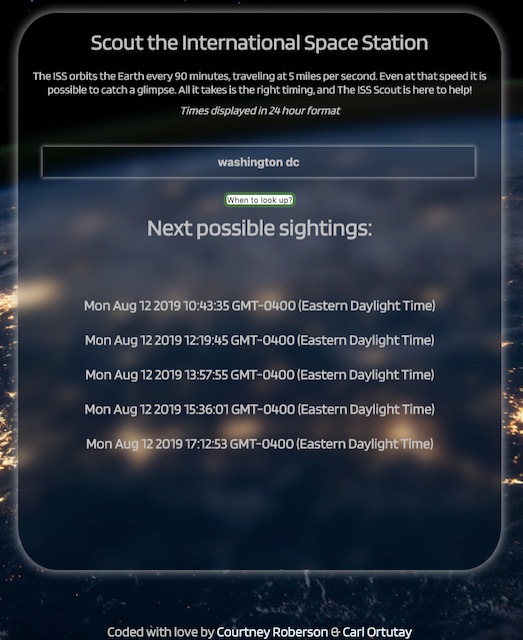

# The International Space Station (ISS) Scout

Scout the Station here! https://coro121.github.io/The-ISS-Scout/

## Summary

Our mimalist, one-page, app invites you to explore the final frontier. The APIs we've used allows visitors to enter their address or another point of interest and receive a list of times for potential sightings of the ISS. Whether you're planning a date or spending time with friends and family, our application's mission is to bring about wonder and excitement.

## Implemented Technologies

To build our application, we've used the following web programming languages:

- HTML5
- CSS3
- JavaScript
- jQUery

### Note
Some web browsers may prevent your results from displaying. In order to receive your sighting dates and times, please ensure that any extensions you are running "trusts" our secure site.

## Mission Control

**Carl Ortutay**, Engineer  
**Courtney Roberson**, Engineer
